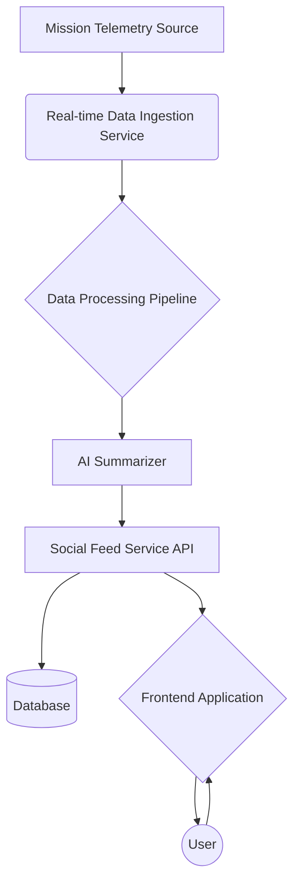

# Social Spacefeed - High-Level Architecture

This document outlines the high-level architecture for the Social Spacefeed MVP.

## Architecture Diagram

## Component Descriptions

-   **Mission Telemetry Source (A):** The origin of the live mission data. For the MVP, this could be a simulated stream.
-   **Real-time Data Ingestion Service (B):** A service (e.g., using WebSockets or a message queue like RabbitMQ/Kafka) that receives the raw telemetry data.
-   **Data Processing Pipeline (C):** An intermediary that orchestrates data handling.
-   **AI Summarizer (D):** A core component that takes complex telemetry and generates easy-to-understand text summaries. We can use a pre-trained language model for this (e.g., from OpenAI, Google, or a self-hosted model).
-   **Social Feed Service API (E):** A REST or GraphQL API that the frontend will communicate with. It will handle creating new posts (from the summarizer), and user interactions like likes and comments.
-   **Database (F):** A database to store the feed posts, user comments, and likes. A NoSQL database like MongoDB or a relational database like PostgreSQL could work well here.
-   **Frontend Application (G):** A web application (e.g., built with React, Vue, or Svelte) that displays the live feed and allows users to interact with it.
-   **User (H):** The end-user of the Social Spacefeed application.

This architecture is designed to be scalable. We can add more components to the `Data Processing Pipeline` in the future, such as a `Visualization Engine` to create charts and graphs from the telemetry data.