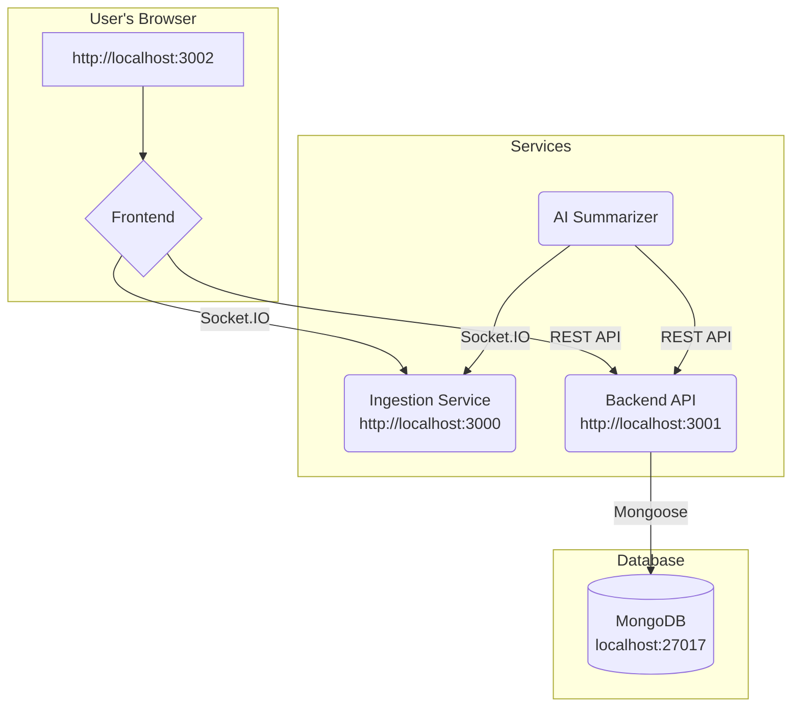

# URL and Port Mappings

This document provides a visual guide to the URLs and ports used by each service in the Social Spacefeed application when running locally.

## URL Diagram

## Service URLs

-   **Frontend:** `http://localhost:3002`
    -   This is the URL you will open in your web browser to use the Social Spacefeed application.

-   **Ingestion Service:** `http://localhost:3000`
    -   This service provides a WebSocket connection for real-time data streaming. The frontend and AI summarizer connect to this URL.

-   **Backend API:** `http://localhost:3001`
    -   This service provides the REST API for posts, likes, and comments. The frontend and AI summarizer connect to this URL.

-   **MongoDB:** `localhost:27017`
    -   This is the default port for the MongoDB database. The Backend API connects to this to store and retrieve data.