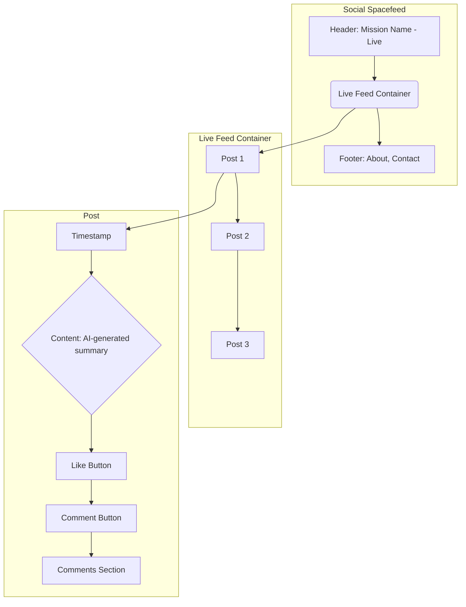

# Frontend Wireframes

This document contains basic wireframes for the Social Spacefeed MVP.

## Main Feed Screen

This wireframe shows the layout of the main screen where users will view the live feed.

## Wireframe Description

-   **Header:** Displays the name of the mission and a "Live" indicator to show that the feed is actively updating.
-   **Live Feed Container:** The main area of the screen, which will contain a scrolling list of posts.
-   **Post:** Each post in the feed will have:
    -   A **timestamp** indicating when the event occurred.
    -   The **content**, which is the AI-generated summary of the telemetry data.
    -   A **Like button** for users to react to the post.
    -   A **Comment button** to open a modal or expand a section for adding comments.
    -   A **Comments Section** to display existing comments on the post.
-   **Footer:** Contains links to "About" and "Contact" pages.

This simple layout focuses on the core functionality of the MVP: viewing the live feed and interacting with it through likes and comments.